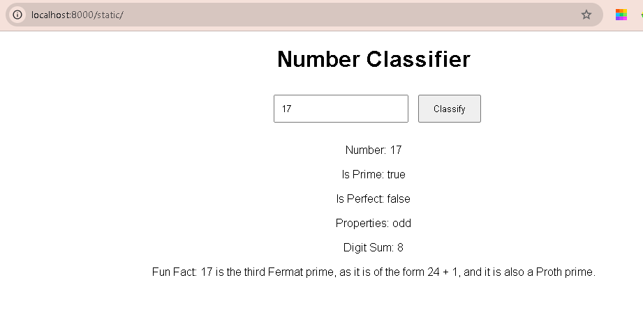
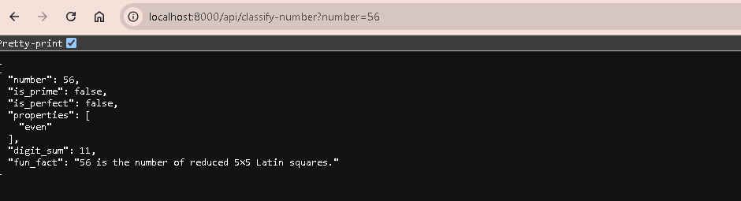
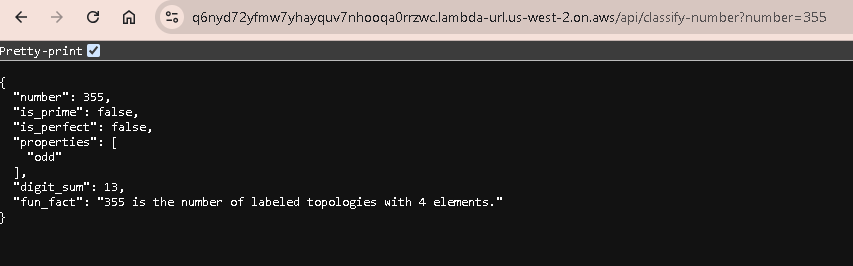

# number-classification-with-python
A simple FastAPI for number classification  with a GET endpoint `/api/classify-number` and a simple frontend at `/static`

This project collects input from user and return output on the number classification with funfacts integration from http://numbersapi.com/.

## API Endpoints

#### GET /static
This get use input and forward to the backend using `/api/classify-number?number=${number}` 
Frontend is build with HTML, CSS and Javascript



####  GET /api/classify-number 
Backend API can be access directly using the same request

```
http://localhost:8000/api/classify-number?number=56

```
Output:




## How to Run this Locally
- [x] Clone this repo - `git clone `
- [x] cd to the repo  `cd  number-classification-with-python`
- [x] Ensure Python is installed `python --version`
- [x] Create a virtual env  `python -m venv venv`
- [x] Activate VENV  `.\venv\Scripts\activate`
- [x] Install requirements.txt `pip install -r requirements.txt`
- [x] Run the App `uvicorn backend.main:app --reload`


## Deploying to AWS Lamda and APIGateWay

- [x] Package your deployment file for AWS using the command

```powershell
mkdir awslamdapackage
pip install -r requirements.txt -t awslamdapackage
cp -r backend awslamdapackage
cp -r frontend awslamdapackage
cd  awslamdapackage
Compress-Archive -Path .\* -DestinationPath ..\awslamdapackage -Force

```




Connectubg to API Gateway
Choose HTTP API
adde Name 